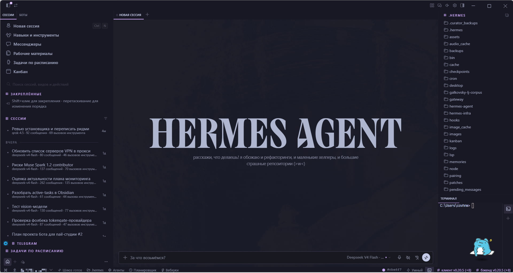
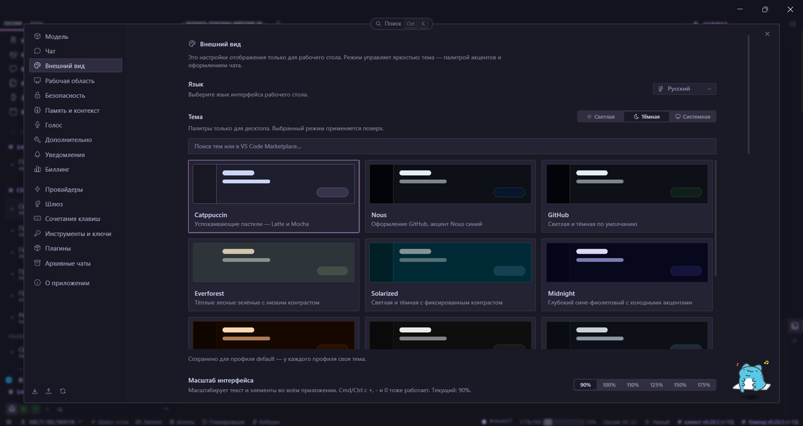
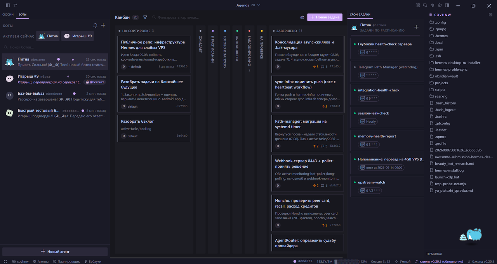

# 🇷🇺 Hermes Desktop — Russian mod

[🇬🇧 English](README.en.md) · [🇷🇺 Русский](README.md)

Full Russian localization for [Hermes Desktop](https://github.com/NousResearch/hermes-agent) on Windows.

[](https://github.com/NousResearch/hermes-agent)
[](https://www.npmjs.com/package/hermes-desktop-ru)
[](https://www.npmjs.com/package/hermes-desktop-ru)
[](https://github.com/upmeister/hermes-desktop-ru/releases)
[](https://github.com/upmeister/hermes-desktop-ru/releases)
[](LICENSE)

**Latest: [v1.0.5](https://github.com/upmeister/hermes-desktop-ru/releases/tag/v1.0.5) · Hermes Desktop 0.20.5 · 2026-08-23**

Hermes Desktop has **no Russian locale in the current release line** (upstream `ru` PRs have sat open since July). i18n-only packs translate the catalog and leave hardcoded strings in components, settings field labels, Bots/kanban, and the Electron main process.

This is not a portable/prebuilt `.exe` patch. It expects a **source install** (`git clone`) and rebuilds `app.asar`.

## Screens







## Why not just a locale file

| | i18n-only pack | this mod |
|---|---|---|
| Catalog keys | ✅ (~2200+) | ✅ full catalog |
| Hardcoded component strings | ❌ | ✅ |
| Bots / kanban / main-process | ❌ | ✅ |
| After `hermes update` | new UI stays English | re-run `hermes-desktop-ru install` |

- **642-rule structural registry** rewrites unique `before → after` blocks in renderer, `ru-constants.ts`, Bots, kanban, and `electron/main.ts`.
- **Doctor-gated installer** — dry-run before any write. Cosmetic misses warn (that spot stays English). Critical logic drift fails closed.
- **Survives `hermes update`**: restore tracked sources to stock → doctor → apply → register `ru` → rebuild `dist` → repack `asar` (original kept as `.stock.bak`).

## Why structural anchors, not `git apply`

`git apply --3way` on a shallow clone can **exit 0** while leaving `<<<<<<<` conflict markers in the tree. Vite then dies with "Encountered diff marker", and the markers poison the *next* mod too.

The registry instead:

- matches **full unique string blocks** anywhere in the file (survives inserts above);
- is idempotent and EOL-preserving;
- reports `MISSING` / `AMBIGUOUS` with exit 1 instead of skipping;
- `EXPECTED_COMMIT` warns (does not block) when HEAD moved past the build base.

## Install

Node.js 18+, Hermes Desktop **closed**, source checkout (default `%LOCALAPPDATA%\hermes\hermes-agent`).

```powershell
npm install -g hermes-desktop-ru
hermes-desktop-ru install
```

| Command | |
|---|---|
| `hermes-desktop-ru install` | install / re-install. Restores tracked clone sources to HEAD |
| `hermes-desktop-ru doctor` | dry compatibility check — no writes, no process kill, no `git restore` |
| `hermes-desktop-ru uninstall` | restore packaged `app.asar` from `.stock.bak` (clone untouched) |
| `hermes-desktop-ru version` | package version (from `package.json`) |
| `hermes-desktop-ru help` | help |

```powershell
hermes-desktop-ru install -Root "D:\path\to\hermes-agent"
```

(`HERMES_AGENT_ROOT` works too.) Or unpack the [release zip](https://github.com/upmeister/hermes-desktop-ru/releases) and run `install.bat`.

Failed `npm run build` is now a hard error. To reuse a bundled `package/dist` (may not match this upstream): `install.ps1 -AllowStaleDist`.

## After `hermes update`

```text
hermes update  →  hermes-desktop-ru install  →  launch
```

`hermes update` does **not** rebuild the already-installed asar. A stale Russian bundle can look alive — it is stale. Always re-run the installer.

`install` runs `git restore` on tracked files in the clone. Other source-level mods in that checkout will not survive. `doctor` does not restore or kill the app.

## Doctor

`hermes-desktop-ru doctor` writes nothing, does not stop Desktop, does not run `npm ci`. It reports:

- `OK` — every registry rule matches;
- `WARN` — cosmetic misses (install may proceed);
- `FAIL` — critical drift (install stops).

If the working tree is dirty, doctor warns and checks the **current** tree.

## Safety

- Local only: no backend, no telemetry, no network from the installer.
- Doctor gate before writes; tracked sources restored to stock on **install** only.
- `app.asar.stock.bak` next to the live asar — `hermes-desktop-ru uninstall` swaps it back; `hermes update` for a full clone reset.
- MIT. Read `package/install-asar.ps1` and `package/registry.json` if you want.

## Troubleshooting

| Symptom | What to do |
|---|---|
| "clone not found" | `-Root` or `HERMES_AGENT_ROOT` |
| Doctor FAIL | upstream moved ahead — [issue "Doctor FAIL"](https://github.com/upmeister/hermes-desktop-ru/issues/new?template=doctor-fail.yml) |
| Access denied / EBUSY | close Hermes Desktop and retry |
| Long `npm ci` | normal with broken `node_modules` after `hermes update` (3–10 min) |
| UI partially English | `hermes-desktop-ru doctor`, then `install` and restart |
| Roll back the mod | `hermes-desktop-ru uninstall` (needs `.stock.bak` from a previous install). Or manually: close Desktop → replace `resources\app.asar` with `resources\app.asar.stock.bak` → launch; full reset — `hermes update` |

## Compatibility

| Hermes Desktop | |
|---|---|
| **0.20.5** | verified (doctor 642/642) |
| older | install the mod release that matches |

Doctor fails after a fresh Hermes bump? Wait for the next mod release or [open an issue](https://github.com/upmeister/hermes-desktop-ru/issues/new/choose).

Upstream Desktop commits and new `en.ts` keys are logged in [UPSTREAM-WATCH.md](UPSTREAM-WATCH.md) (sensor + LLM note; releases stay manual).

## Glossary / what we do not translate

Proper names and commands stay: platforms, models, providers, log filters.
Established terms stay: MCP, DIFF, URL, PR, YOLO.
Stable UI glossary: «Рабочие материалы» (Artifacts), «Обслуживание и диагностика» (Maintenance), «Рассуждения» (Reasoning).

## Credits

- [warment/hermes-desktop-ru](https://github.com/warment/hermes-desktop-ru) — early translation base
- [anatolijlaptev1991-ctrl/hermes-ru](https://github.com/anatolijlaptev1991-ctrl/hermes-ru) — structural/doctor approach
- DrMaks22 — glossary and PR [#72250](https://github.com/NousResearch/hermes-agent/pull/72250)

## License

[MIT](LICENSE)