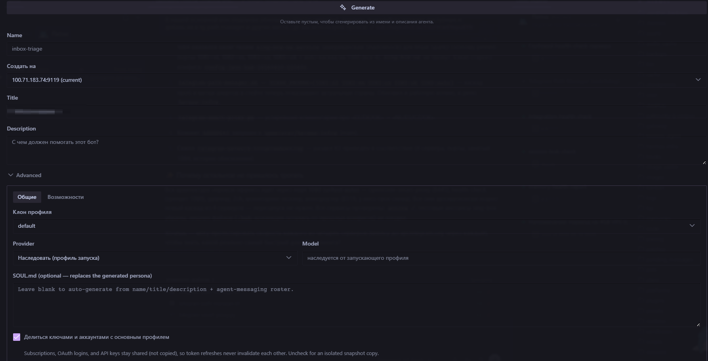

# 🇷🇺 Hermes Desktop — русский мод

Полная русская локализация [Hermes Desktop](https://github.com/NousResearch/hermes-agent) для Windows.

[](https://github.com/NousResearch/hermes-agent)
[](https://www.npmjs.com/package/hermes-desktop-ru)
[](https://github.com/upmeister/hermes-desktop-ru/releases)
[](https://github.com/upmeister/hermes-desktop-ru/releases)
[](LICENSE)



> Единственный активно поддерживаемый русский мод для актуального Hermes Desktop.
> **100% покрытия UI** на **0.20.5** (doctor 637/637): системные строки, настройки,
> канбан, Bots, фильтры сессий и хардкоды компонентов.
> После каждого обновления Hermes достаточно снова запустить установщик.

## Зачем этот мод

Официальный клиент уже умеет несколько языков, но **русского в актуальной ветке нет**.
Этот мод:

- переводит **весь** пользовательский интерфейс, а не только часть ключей;
- чинит строки, которые «не ловятся» обычным i18n (хардкоды в компонентах, Bots, поля настроек);
- **переживает `hermes update`**: после обновления клиента вы просто ставите мод заново;
- перед записью гоняет **doctor** — если апстрим слишком уехал, установщик честно остановится, а не сломает сборку;
- **регулярно обновляется** под новые фичи и строки Hermes — следите за [релизами](https://github.com/upmeister/hermes-desktop-ru/releases).

## Установка

### Что нужно

1. Hermes Desktop, установленный **из исходников** (`git clone`), не portable/prebuilt `.exe`.
2. [Node.js](https://nodejs.org/) 18+ и npm.
3. Закрытый Hermes Desktop на время установки (5–10 минут на `npm run build`).

Стандартный путь клона: `%LOCALAPPDATA%\hermes\hermes-agent`

### npm (рекомендуется)

```powershell
npm install -g hermes-desktop-ru
hermes-desktop-ru install
```

| Команда | Что делает |
|---|---|
| `hermes-desktop-ru install` | установить / переустановить мод |
| `hermes-desktop-ru doctor` | сухая проверка совместимости |
| `hermes-desktop-ru help` | справка |

Клон не в стандартном месте:

```powershell
hermes-desktop-ru install -Root "D:\path\to\hermes-agent"
```

### Без npm

Скачайте [последний release zip](https://github.com/upmeister/hermes-desktop-ru/releases),
распакуйте и запустите **`install.bat`** (или `install.ps1` / `install.ps1 -Doctor` / `-Root …`).

Переменная `HERMES_AGENT_ROOT` тоже задаёт путь к клону.

После `УСТАНОВКА OK` откройте Hermes Desktop — язык станет русским
(при необходимости выберите **Русский** в настройках языка).

## После обновления Hermes

```text
hermes update  →  hermes-desktop-ru install  →  запуск Desktop
```

Установщик сам находит клон, откатывает исходники к стоку, гоняет doctor,
применяет перевод, пересобирает `dist` и упаковывает `app.asar`.

> Важно: `hermes update` **не** пересобирает уже установленный asar.
> Старый русский UI может «казаться живым» после апдейта — это старый бандл.
> Надёжный путь — всегда прогонять установщик после обновления клиента.

## Что внутри

| Область | Покрытие |
|---|---|
| Основной i18n-каталог (чат, настройки, шлюз, биллинг, онбординг…) | 100% |
| Подписи и описания полей настроек | 100% |
| Канбан | 100% |
| Плагин Bots (агенты, группы, cron, petdex, хаб навыков, меню) | 100% |
| Фильтры/группировка сессий | 100% |
| Хардкоды UI (splash, мессенджеры, темы, MoA…) | 100% |

## Как переводим

- Имена собственные и команды **не трогаем** (платформы, модели, фильтры логов).
- Устоявшиеся термины оставляем: MCP, DIFF, URL, PR, YOLO.
- Единый словарь UI: «Рабочие материалы», «Обслуживание и диагностика», «Рассуждения».

## Совместимость

| Hermes Desktop | Статус |
|---|---|
| **0.20.5** | ✅ проверено (doctor 637/637, install OK) |
| ниже 0.20.5 | ⚠️ старые проверки; ставьте актуальный мод под свою версию |

Если doctor ругается после свежего апдейта Hermes — подождите релиз мода
или [откройте issue](https://github.com/upmeister/hermes-desktop-ru/issues/new/choose).

## Возможные проблемы

| Симптом | Что сделать |
|---|---|
| «не найден клон hermes-agent» | `-Root` или `HERMES_AGENT_ROOT` |
| Doctor FAIL | апстрим ушёл вперёд — [issue «Doctor FAIL»](https://github.com/upmeister/hermes-desktop-ru/issues/new?template=doctor-fail.yml) |
| Access is denied / EBUSY | закройте Hermes Desktop и повторите |
| Долго на npm ci | нормально при битых `node_modules` после `hermes update` (3–10 мин) |
| UI частично на английском | `hermes-desktop-ru doctor`, затем `install` и перезапуск |
| `hermes update` и занятый `hermes.exe` | ограничение Windows: закройте Desktop/шлюз |

## Обратная связь

Баги, непереведённые места и сбои doctor — через
[GitHub Issues](https://github.com/upmeister/hermes-desktop-ru/issues/new/choose)
(есть шаблоны). Так быстрее разобраться: версия, вывод doctor и скрин в одном месте.

## Основа и благодарности

- [warment/hermes-desktop-ru](https://github.com/warment/hermes-desktop-ru) — ранняя база перевода
- [anatolijlaptev1991-ctrl/hermes-ru](https://github.com/anatolijlaptev1991-ctrl/hermes-ru) — идеи structural/doctor-подхода
- DrMaks22 — словарь и PR [#72250](https://github.com/NousResearch/hermes-agent/pull/72250)

Спасибо авторам и сообществу Hermes ❤️

## Лицензия

[MIT](LICENSE)
